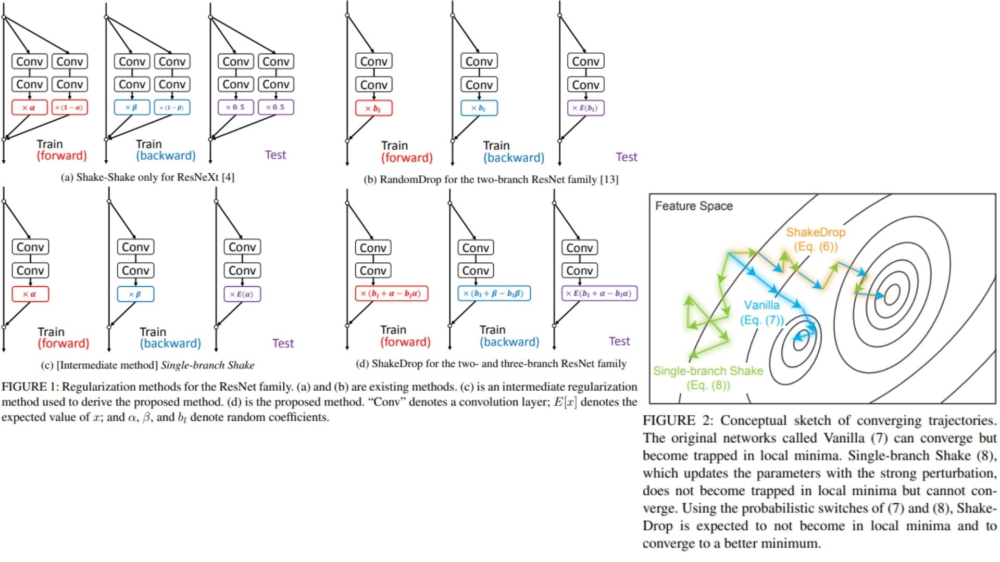

# 🔫 ShakeDrop-Replication PyTorch Implementation

This repository contains a replication of **ResNet with ShakeDrop Regularization** using PyTorch. The goal is to reproduce a **ResNet backbone** enhanced with **ShakeDrop**, which probabilistically perturbs residual branches to improve regularization and convergence.

- Implemented **ResNet** with ShakeDrop for deep residual learning.  
- Architecture follows:  
**Conv1 → ResidualBlock1 → ResidualBlock2 → ResidualBlock3 → ResidualBlock4 → BN → ReLU → AvgPool → Flatten → FC**  
**Paper**: [ShakeDrop Regularization for Deep Residual Learning](https://arxiv.org/abs/1705.07485)

---

## 🖼 Overview – ResNet with ShakeDrop

  

- **Figure 1:** Standard ResNet residual connections in our ShakeDrop implementation. Each block adds its input to the output via identity or projection shortcuts. ShakeDrop is applied to residual paths during training, introducing stochastic perturbation.  

- **Figure 2:** Conceptual illustration of ShakeDrop perturbation. Probabilistic switches randomly perturb residual branches:  
  - Vanilla ResNet can converge but may get trapped in local minima.  
  - Single-branch Shake introduces strong perturbation, avoiding local minima but may fail to converge.  
  - ShakeDrop combines these strategies, enabling convergence to better minima while regularizing the network.  

> ShakeDrop-ResNet extends standard ResNet by applying stochastic perturbation on residual branches. This prevents overfitting, encourages exploration of better minima, and improves generalization across datasets.


---

## 🏗 Project Structure

```bash
ShakeDrop-Replication/
│
├── src/
│   ├── layers/
│   │   ├── conv_layer.py          # BN → ReLU → Conv2d
│   │   ├── residual_block.py      # Basic/Bottleneck + ShakeDrop
│   │   ├── shortcut_layer.py      # Identity / Projection shortcut
│   │   ├── shake_drop.py          # ShakeDrop layer: probabilistic perturbation
│   │   ├── pool_layers/
│   │   │   ├── maxpool_layer.py   # MaxPooling
│   │   │   └── avgpool_layer.py   # Global Average Pooling
│   │   ├── flatten_layer.py       # Conv → FC transition
│   │   └── fc_layer.py            # Fully Connected Layer (1000 classes)
│   │
│   ├── model/
│   │   └── resnet_shakedrop.py    # Full ResNet backbone + ShakeDrop implementation
│   │
│   └── config.py                  # Hyperparameters: channels, block counts, α, β, survival prob etc.
│
├── requirements.txt
└── README.md
```
---

## 🔗 Feedback

For questions or feedback, contact: [barkin.adiguzel@gmail.com](mailto:barkin.adiguzel@gmail.com)
